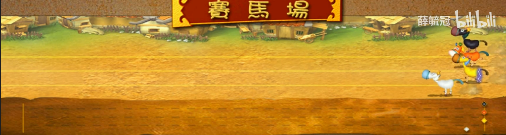

# 注意：
游戏的制作仅为ao中的Quest 4，不能用于制作任何商业用途。特别是赌马类游戏！
如有人用该代码制作商业类游戏，与作者无关。后果自负！

# 三国赛马场
这个游戏的灵感来自一款以三国为背景的休闲类游戏中的赛马的场景，如下图所示：

一共四匹良驹：的卢(Dilu)、绝影(BlackShadow)、赤兔(Chitu)、抓黄飞电(YellowLighting)

一开始可以通过RequestWuzhu获取三国五铢钱。
ThreeKingdoms = "cVVsTGjJPSf7eckrJaT97M9UhUOHrarzkC5UjIZg2Zg"
Send({ Target = ThreeKingdoms, Action = "RequestWuzhu"})

## 游戏规则
允许最少2个玩家。
### 等待期：5min
最后进来的一个玩家进行质押以后，会刷新5min的等待期

1.玩家可以选择一匹马，然后押注自己喜欢的马。

Send({Target = ThreeKingdoms, Action = "JumpInto"})

返回欢迎来到三国赌马场。可以选择的马匹。

Send({Target = ThreeKingdoms, Action = "StakingHorse", Recipient = ThreeKingdoms, Quantity = "1000", Horse = "Dilu"})

输入的马匹不存在，则随机选择一匹马。

当等待期时间结束后，任何一个玩家，可以通过  Send({Target = ThreeKingdoms, Action = "HorseTicker"}) 来开始游戏。

Send({Target = ThreeKingdoms, Action = "Retire"})

如果已经质押了五铢钱，是不能退赛的。等当前这局结束以后可以退赛。

### 游戏期：
有马匹到达终点时，结束。

2.终点为20个格子。先达到的马匹获胜。每回合前进的距离等于，ceil( random(1,3) * max(stakingRatio, 0.7))

解释：1~3的随机数 乘以 质押占比，但是占比不超过50%，不小于10%。计算结果如果存在小数，则向上取整。

3.马匹有一次释放技能的机会。变成 5 * ceil(1 * random(1,3) * max(stakingRatio, 0.7)) 的距离，即普通移动的五倍。也可能会还没释放游戏就结束了。

4.如果有多匹马到达了终点，则并列第一。

5.第一名可以平分所有的筹码。

# 如何加载游戏
1.加载所需代码
.load-blueprint token
.load path/3kingdoms-arena.lua
.load path/3kingdoms-speedup.lua

2.设置参数
ThreeKingdoms = "your process"
PaymentTokenAddr = "the process which holds token"

3.正式开张
Send({Target = ao.id, Action = "Launched"})
