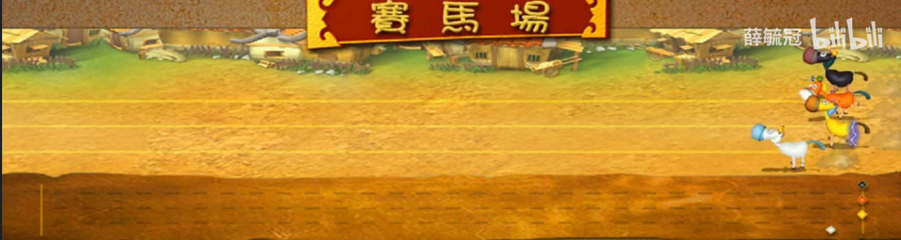

[English](README.md) | 简体中文

# 注意：
游戏的制作仅为ao中的Quest 4，不能用于制作任何商业用途。特别是赌马类游戏！
因此游戏中的代币可以直接通过Request获取，不足的时候，也可以增发。
如有人用该代码制作商业类游戏，与作者无关。后果自负！

# 源代码
[源代码](3kingdoms-speedup.lua)

# 三国赛马场
这个游戏的灵感来自一款以三国为背景的休闲类游戏中的赛马的场景，如下图所示：

一共四匹良驹：的卢(Dilu)、绝影(BlackShadow)、赤兔(Chitu)、抓黄飞电(YellowLighting)

一开始可以通过RequestWuzhu获取三国五铢钱。
```
ThreeKingdoms = "cVVsTGjJPSf7eckrJaT97M9UhUOHrarzkC5UjIZg2Zg"
Send({ Target = ThreeKingdoms, Action = "RequestWuzhu"})
```


## 游戏规则
### 等待期：5min
欢迎来到三国赛马场。
```
Send({Target = ThreeKingdoms, Action = "JumpInto"})
```

最后进来的一个玩家进行质押以后，会刷新5min的等待期

1.玩家可以选择一匹马，然后押注自己喜欢的马。

```
Send({Target = ThreeKingdoms, Action = "StakingHorse", Recipient = ThreeKingdoms, Quantity = "1000", Horse = "Dilu"})
```


输入的马匹不存在，则随机选择一匹马。

当等待期时间结束后，任何一个玩家，可以通过 HorseTicker 消息来开始游戏。
```
Send({Target = ThreeKingdoms, Action = "HorseTicker"}) 
```

可以使用 Retire 消息来退出游戏。
```
Send({Target = ThreeKingdoms, Action = "Retire"})
```

如果已经质押了五铢钱，是不能退赛的。等当前这局结束以后可以退赛。

### 游戏期：
2.终点为20个格子。先达到的马匹获胜。每回合前进的距离计算规则如下,
```
local function calStakingRatioForRunning(ratio)
    if ratio == nil then
        return 0
    end

    if ratio > 0.7 then
        return 0.7
    end

    if ratio < 0.1 then
        return 0.1
    end

    return ratio
end

local ratio = calStakingRatioForRunning(Staking["StakingRatioHorse"][horseId])

math.ceil(math.random() * 3 * ratio)
```

3.马匹有一次释放技能的机会。变成 5 倍的距离，即普通移动的五倍。也可能会还没释放游戏就结束了。释放技能的函数如下，
```
local function ultimateSkill(state)
    if not state["ultimateSkill"] then
        return false
    end

    if math.random() > 0.8 then
        state["ultimateSkill"] = false
        return true
    end

    return false
end
```

4.有马匹到达终点时，游戏结束。如果有多匹马到达了终点，则并列第一。

5.第一名马匹的质押玩家可以根据质押比例获得所有的五铢。


